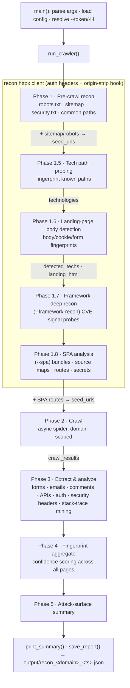
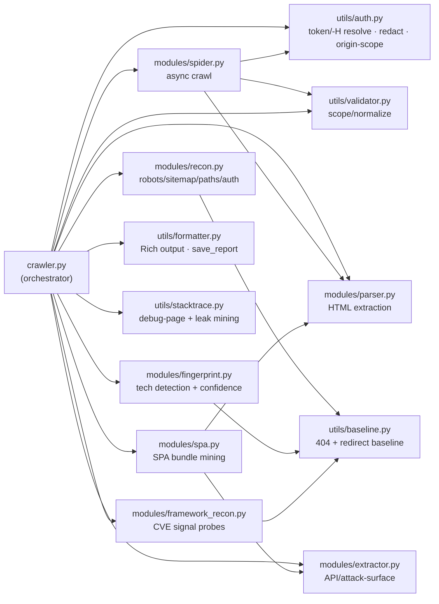
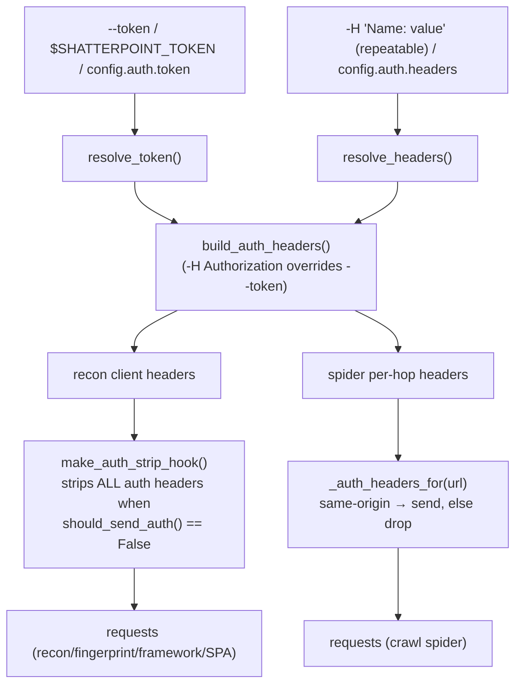

# shatterpoint architecture

How a scan flows end-to-end, what each phase produces, and the precision guards that keep findings honest. shatterpoint is **signal-only** — it maps and detects, it never exploits.

---

## The pipeline

A single scan runs nine ordered phases inside one async run. Earlier phases feed later ones (`seed_urls`, `landing_html`, `detected_techs`, `crawl_results`).

### Phase responsibilities

| Phase | Calls | Populates `results[...]` | Carries forward |
|---|---|---|---|
| **1 — Pre-crawl recon** | `ReconModule.run_all` | `robots_txt`, `sitemap`, `security_txt`, `common_paths` | sitemap + robots-disallowed → `seed_urls` |
| **1.5 — Tech path probing** | `Fingerprinter.probe_known_paths` → `finalize_technologies` | `technologies` | `detected_techs` |
| **1.6 — Landing body detection** | `recon_client.get(target)` · `HTMLParser.extract_forms` · `Fingerprinter.fingerprint_from_response` → `finalize_technologies` | `technologies` (merged) | `detected_techs`, `landing_html` |
| **1.7 — Framework deep recon** | `FrameworkRecon.analyze` | `framework_recon` | — (CVE signals + manual pointers) |
| **1.8 — SPA analysis** | `SPAAnalyzer.analyze` | `spa` | SPA routes → `seed_urls`; SPA endpoints → Phase 3 |
| **2 — Crawl** | `Spider.crawl(seed_urls)` | `all_urls` | `crawl_results` |
| **3 — Extract & analyze** | `HTMLParser`, `Extractor`, `ReconModule.detect_*`, `mine_response` | `forms`, `api_endpoints`, `comments`, `emails`, `parameters`, `auth_mechanisms`, `security_headers`, `interesting_files`, `debug_exposure`, (+`technologies` if a stack trace reveals a framework) | `forms_by_url` |
| **4 — Fingerprint aggregate** | `Fingerprinter.fingerprint_aggregate` → `finalize_technologies` | `technologies` (final) | — |
| **5 — Attack surface** | `Extractor.analyze_attack_surface` | `attack_surface`, `scan_duration`, `pages_crawled` | — |

---

## Module call-graph

---

## Authentication & origin scoping

Credentials (`--token` bearer, or any `-H "Name: value"`) are sent **same-origin only** and stripped on cross-origin redirects, so a token / API key / cookie never leaks to a third party. Values are redacted in the banner and never written to the report.

---

## Results schema

Every top-level key in the saved JSON, and the phase that fills it:

| Key | Phase |
|---|---|
| `target`, `scan_start` | init |
| `technologies` | 1.5, 1.6, 3 (stack-trace), 4 |
| `robots_txt`, `sitemap`, `security_txt`, `common_paths` | 1 |
| `framework_recon` | 1.7 |
| `spa` | 1.8 |
| `all_urls` | 2 |
| `forms`, `file_uploads`, `api_endpoints`, `comments`, `emails`, `parameters`, `interesting_files`, `auth_mechanisms`, `security_headers`, `debug_exposure` | 3 |
| `attack_surface`, `scan_duration`, `pages_crawled` | 5 |

---

## Precision guards (why findings are trustworthy)

| Guard | What it prevents | Where |
|---|---|---|
| **404 content baseline** | catch-all routers (SPA dev servers) that 200 every path → phantom path hits | `utils/baseline.py` |
| **Redirect baseline** | apps that 302 every path to a login (GitLab) → flood of false probe "findings" | `Baseline.is_catchall_redirect` |
| **Content-confirm gate** | a bare 200 at `/console` / `/admin/` masquerading as the real product | `framework_recon` `confirm_any` |
| **Conflict resolution** | two incompatible techs both firing (Laravel vs Rails on shared `<meta csrf-token>`) | `fingerprint.resolve_conflicts` |
| **Product-specific signatures** | generic paths/headers (`/admin/`, `x-powered-by: PHP`) cross-tagging frameworks | `signatures/fingerprints.yaml` |
| **Signal-only, no exploit** | the tool never sends a payload; CVEs are mapped as "verify manually" | `framework_recon` (GET-only, CI passivity test) |

---

*Keep this in sync with `crawler.py:run_crawler` when phases change.*
